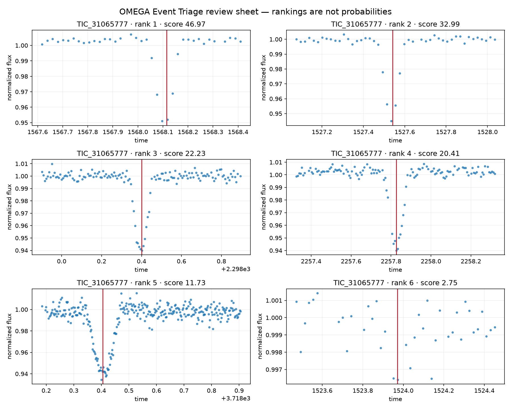

# OMEGA Event Triage — Public Evidence Showcase

OMEGA is Henry Barrientos's independent astronomy-software project for turning
stellar light curves into compact, auditable queues for human review. This
repository preserves the public evidence, benchmark outcome, important
failures, and authorship record without publishing the executable engine or
future commercial implementation.

> **Status:** evidence showcase, not a software download. The research-alpha
> implementation and future product development are private as of August 10,
> 2026. No customer adoption, revenue, scientific discovery, or general
> detector superiority is claimed.

## What I built and tested

- A Python workflow that ingests CSV, Parquet, or public TESS light curves and
  produces ranked event queues, reviewer tables, a static report, provenance,
  failure statuses, hashes, and a tamper-detecting artifact manifest.
- A locked 1,000-target benchmark producing 2,180 method records across OMEGA,
  Astropy Box Least Squares, and Transit Least Squares paths.
- Independent local and server completion audits that each passed 22 of 22
  integrity checks, including byte-level verification of 1,000 server inputs.
- A preserved record of failed approaches, corrections, timeouts, calibration
  problems, and the final claim decision.

## What the benchmark actually found

The strongest planned claim did **not** survive the test.

- OMEGA completed all 600 untouched test targets without an operational
  failure and had a 4.24-second median runtime.
- It exactly recovered the period for 9 of 300 positive test targets: 9 of 298
  deterministic injections and 0 of 2 real-catalog systems.
- Its exact-recovery difference versus the configured BLS comparison was
  +0.030 with a paired 95% interval of [0.013, 0.050].
- The evaluation was injection-dominated and limited to a 40–300 day,
  3–5-event niche, so it does not establish broad or real-sky superiority.

That negative result changed the project. The next question is not whether
OMEGA replaces professional astronomy software. It is whether an auditable,
human-in-the-loop queue can reduce review time without hiding events that a
researcher considers important.

## Why this is a serious student-research project

The result is not presented as a breakthrough. The evidence shows a complete
research cycle:

1. a public-data observation became a reproducible case study;
2. a scaling idea became a frozen comparative benchmark;
3. the benchmark exposed limits instead of confirming the hoped-for claim;
4. those limits changed the product question;
5. the next pilot has measurable success and failure gates.

The strongest accomplishment is the willingness and technical ability to
design a test that could reject the original idea, preserve the rejection, and
use it to choose the next experiment.

## Evidence map

- [Benchmark summary](BENCHMARK_SUMMARY.md)
- [Development and failure record](DEVELOPMENT_RECORD.md)
- [Machine-readable verification record](evidence/verification.json)
- [College and interview evidence](COLLEGE_EVIDENCE.md)
- [AI usage and authorship disclosure](AI_USAGE.md)
- [Rights and publication boundary](RIGHTS.md)
- [TIC 31065777 citable research package](https://doi.org/10.5281/zenodo.21662098)

## Current product boundary

The private development path is an **auditable astronomy review workbench**:
algorithm comparison, ranked review, provenance, collaboration, custom data
adapters, and reproducible delivery. It will not be marketed as commercially
validated until independent users demonstrate a meaningful review-time
reduction without losing reviewer-important events.

## Authorship

Henry Barrientos originated the project direction, provided the computing
resources, operated and reviewed the experiments, chose the evidence and claim
boundaries, and is responsible for explaining and representing the work.
OpenAI Codex contributed substantially to implementation, testing,
documentation, benchmark operations, and repository work. AI assistance is
disclosed rather than presented as unaided authorship.

